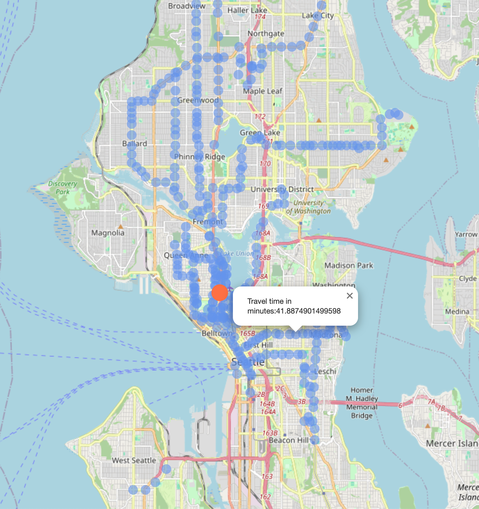

# Seattle Commute Map

## Overview
This project stems from personal frustration when trying to find a location to live where we are able to commute to our work within one hour by public transit. Instead of entering address into Google Map and check how long it takes to commute to work one by one, I wanted to be able to look at a map and directly see the area that satisfies the constraint of max commute time. Luckily, Sound Transit has published transit route data from all different transit agencies in the  Puget Sound region. The open transit data is what makes this map visualisation project possible.

The python script map.py take the commute destination's coordinate and max commute time as input, and plot all transit stops that can get to the commute destination under the max commute time onto a map and save the map into [map.html](map.html).

*Example map: Microsoft Studio X and all transit stops that have < 30 minutes commute to Studio X*

## Methodology
The script first finds all the transit stops around the commute destination that are under the min(MAX_WALKING_TO_STOP_TIME,max_commute_time). For each stop in the result, the script looks up all the transit routes that go through the stop and store them. Then the script find the longest trip time of each route and use them to find all the stops on the given routes that can get to the commute destination under the time constraint.

This methodology does not consider transit commute options that require transfer. From personal experience, transfer often adds about 15 minutes time over the estimated travel time from Google Map. Hence it is not considered in this project.

When calculating the commute time, we are using the longest trip time for each route as we assume that the user is commuting during the peak traffic hour, and the longest trip time for each route occurs during the peak traffic hour too.

## Setup
List of dependencies:
* geopy
* numpy
* sklearn
* pandas

Due to data size limitation, the transit data is not uploaded into the repository. You would need to download the data from Sound Transit into the local directory of this repository. Link to Sound Transit open transit data: https://www.soundtransit.org/help-contacts/business-information/open-transit-data-otd/otd-downloads .

To customise the map for your commute destination and max commute time, put in the latitude, longitude of the commute destination, and the max commute time (minutes) into the [input.txt](input.txt), seperate by commas. Then simply run [map.py](map.py). For step-by-step walkthrough, the script is also available in [jupyter notebook form](transit_map_process.ipynb).

The below are two additional constants in the script that you can adjust based on your scituation:
* MAX_WALKING_TO_STOP_TIME: The maximum time you are willing to walk/run/bike/skateboard to the transit stop that is close to your commute destination. By default, MAX_WALKING_TO_STOP_TIME is 15 minutes.
* WALKING_TO_STOP_SPEED: The speed of travelling to the transit stop. By default, WALKING_TO_STOP_SPEED is 3 mile/hour.
